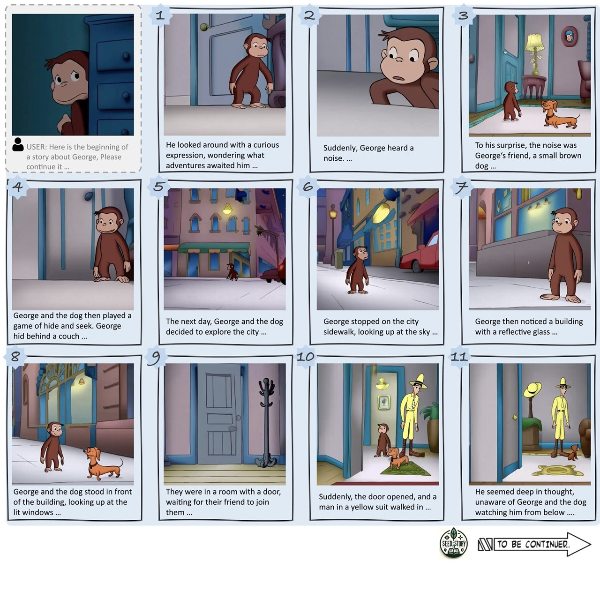
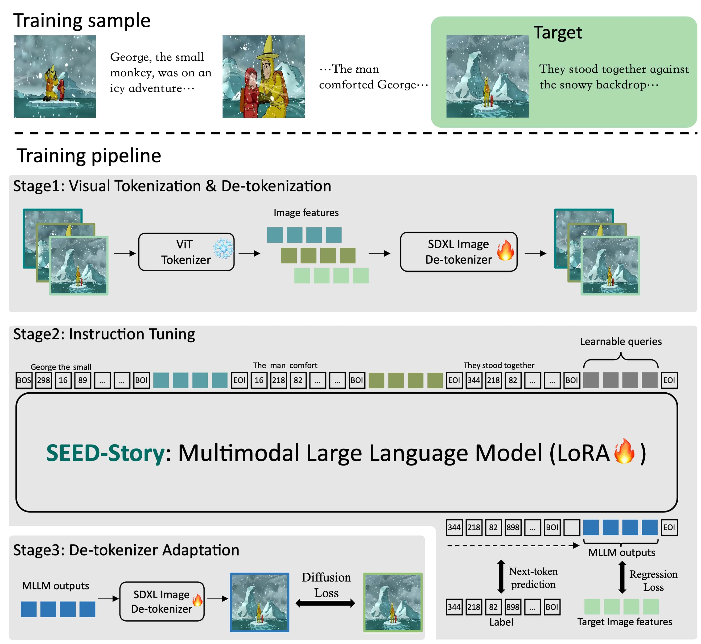
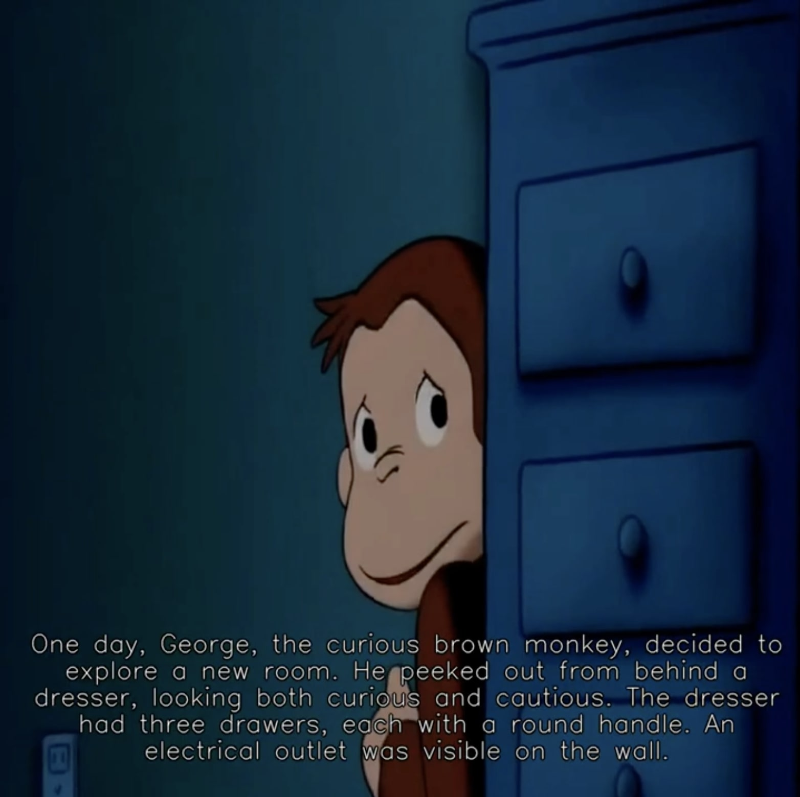
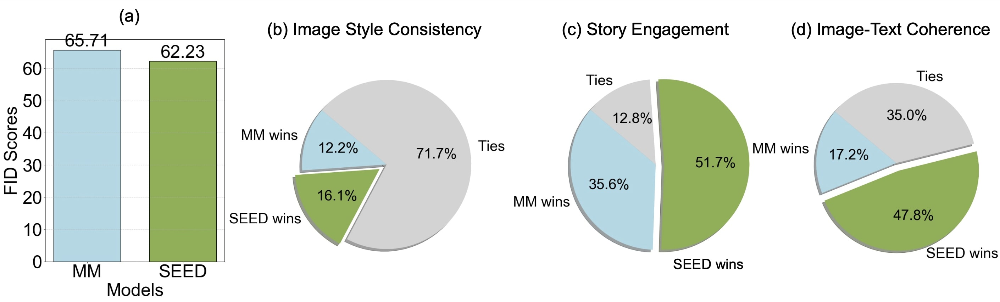

# SEED-Story
[](https://arxiv.org/abs/2407.08683)
[](https://huggingface.co/TencentARC/SEED-Story)
[](https://huggingface.co/datasets/TencentARC/StoryStream)

We introduce SEED-Story, a MLLM capable of generating multimodal long stories consisting of rich and coherent narrative texts, along with images that are consistent in characters and style, based on [SEED-X](https://github.com/AILab-CVC/SEED-X). 
We also release StoryStream, a large-scale dataset specifically designed for training and benchmarking multimodal story generation.


<!---
**TL;DR:** We introduce SEED-Story, a MLLM capable of generating multimodal
long stories consisting of rich and coherent narrative texts, along with images that are consistent in characters and
style. We also release the StoryStream Dataset to build this model.
-->


## TODOs
- [x] Release the StoryStream dataset.
- [x] Release inference code and model checkpoints.
- [x] Release training code for instruction tuning.

## Introduction
The introduced SEED-Story, powered by MLLM, is capable of **generating multimodal long stories** from user-provided images and texts as the beginning of the story. The generated story consists of rich and coherent narrative texts, along with images that are consistent in characters and style. The story can span up to 25 multimodal sequences, even though we only use a maximum of 10 sequences during training.


Given the same initial image but different opening text, SEED-Story can generate different multimodal stories. The top branch starts with text referencing “the man in the yellow hat,” leading to images that include the character. The bottom branch starts without mentioning the man, resulting in stories that diverge from the first by excluding him.


## Method
In **Stage 1**, we pre-train an SD-XL-based de-tokenizer to reconstruct images by taking the features of a pre-trained ViT as inputs. 

In **Stage 2**, we sample an interleaved image-text sequence of a random length and train the MLLM by performing next-word prediction and image feature regression between the output hidden states of the learnable queries and ViT features of the target image. 

In **Stage 3**, the regressed image features from the MLLM are fed into the de-tokenizer for tuning SD-XL, enhancing the consistency of the characters and styles in the generated images.



## Video Demo
<a href="https://youtu.be/_t87U1tLiyQ"></a>

*Here is a video demo for SEED-Story. Click it to redirect to YouTube! In this demo, we utilize an Image-to-Video model to animate our generated images and employ an AI voice to narrate the accompanying story text. We sincerely thank Meixi Chen for producing this demo.*

## Usage

### Dependencies
- Python >= 3.8 (Recommend to use [Anaconda](https://www.anaconda.com/download/#linux))
- [PyTorch >=2.0.1](Recommend to use torch==2.1.2+cu121)(https://pytorch.org/)
- NVIDIA GPU + [CUDA](https://developer.nvidia.com/cuda-downloads)

### Installation
Clone the repo and install dependent packages

  ```bash
  git clone 
  cd SEED-Story
  pip install -r requirements.txt
  ```

### Data Preparation
We release the StoryStream dataset for training and testing multimodal story generation. Download the images and story text files in [StoryStream](https://huggingface.co/datasets/TencentARC/StoryStream).

The StoryStream dataset consists of 3 subsets, Curious George, Rabbids Invasion, and The Land Before Time. We take the George subset as an example. 

The jsonl files contain all the data. Each line of it contains a story of 30 images and corresponding story text. The "image" component is a list of the path of 30 images. The "captions" component is a list of 30 corresponding story text.

For training efficiency, you may chunk the story into a length of 10 just like we did. The script for chunking is in `./StoryStream/chunk_data.py`.

### Model Weights
We release the pre trained Tokenizer, the pre-trained De-Tokenizer, the pre-trained foundation model **SEED-X-pretrained**, 
the StoryStream instruction-tuned MLLM **SEED-Story-George**, and the StoryStream tuned De-Tokenizer in **Detokenizer-George** [SEED-Story Hugging Face](https://huggingface.co/TencentARC/SEED-Story).

Please download the checkpoints and save them under the folder `./pretrained`.

You also need to download [stable-diffusion-xl-base-1.0](https://huggingface.co/stabilityai/stable-diffusion-xl-base-1.0), [Llama-2-7b-hf](https://huggingface.co/meta-llama/Llama-2-7b-hf) and [Qwen-VL-Chat](https://huggingface.co/Qwen/Qwen-VL-Chat), and save them under the folder `./pretrained`. Please use the following script to extract the weights of visual encoder in Qwen-VL-Chat.
```bash
python3 src/tools/reload_qwen_vit.py
```

### Inference
#### Inference with SEED-Story
```bash
# multimodal story generation
python3 src/inference/gen_george.py
# story visualization with multimodal attention sink
python3 src/inference/vis_george_sink.py
```

### Evaluation
We evaluate the multimodal generation result with GPT4 API. The script is under the folder `./src/eval`. We evaluation the generation results by given the starting from validation set. The evaluation is from 3 aspects: image style consistency, story engaging, and text-image coherence.

|          | Style | Engaging | Coherence |
|----------|----------|----------|----------|
| GPT4 Eval   | 8.61    | 6.27   | 8.24    |

The comparative evaluation result is shown below.




### Instruction Tuning
#### Stage1: Visual Tokenization & De-tokenization
Please refer to [SEED-X](https://github.com/AILab-CVC/SEED-X) for Visual Tokenization & De-tokenization.

#### Stage2: Instruction Tuning
1. Prepare the pre-trained models (See Model Weights).
2. Prepare the instruction tuning data. For example, when using "build_long_story_datapipe" dataloader for StoryStream, each folder stores several jsonl files, each jsonl file contains at most 10K pieces of content, with an example of the content as follows:
```bash
{"id": 102, "images": ["000258/000258_keyframe_0-19-49-688.jpg", "000258/000258_keyframe_0-19-52-608.jpg", "000258/000258_keyframe_0-19-54-443.jpg", "000258/000258_keyframe_0-19-56-945.jpg", "000258/000258_keyframe_0-20-0-866.jpg", "000258/000258_keyframe_0-20-2-242.jpg", "000258/000258_keyframe_0-20-4-328.jpg", "000258/000258_keyframe_0-20-10-250.jpg", "000258/000258_keyframe_0-20-16-673.jpg", "000258/000258_keyframe_0-20-19-676.jpg"], "captions": ["Once upon a time, in a town filled with colorful buildings, a young boy named Timmy was standing on a sidewalk. He was wearing a light green t-shirt with a building motif and matching gloves, looking excited about the day ahead.", "Soon, Timmy joined a group of people gathered in a park. Among them was a man in a yellow hat and green tie, a lady in a pink dress holding a bag and a spray bottle, and two other children in white shirts holding bags. They were all ready to start their day's activity.", "Timmy stood next to the man in the yellow hat, who was also wearing yellow gloves and a shirt with a cityscape design. Timmy, sporting a green T-shirt with a recycling symbol, held a clear plastic bag filled with recyclables and a piece of paper. They were ready to start their city clean-up mission.", "Timmy, still smiling, began walking along a sidewalk with a silver railing, excited to help clean up his beloved city, and his enthusiasm was contagious.", "The group gathered in the park, preparing for their clean-up activity. The man in the yellow hat held a clipboard, while a child nearby wore gloves and carried a trash picker. Everyone was eager to start.", "Suddenly, George, the brown monkey, appeared. He stood between two individuals, happily holding a blue bowling pin with a castle design. George was always ready to join in on the fun and lend a helping hand.", "One of the group members held a trash bag and a clipboard while wearing gloves. They were all set to start the clean-up, with George eager to help.", "As they started cleaning, one of the children handed a drawing to an adult. The drawing was of flowers, a symbol of the beauty they were trying to preserve in their city.", "The group, holding hands and carrying bags, walked down the sidewalk. They were a team, working together to make their city cleaner and more beautiful.", "As they walked, they passed a toddler in white clothes and an adult pushing a stroller. The city was bustling with life, and everyone was doing their part to keep it clean."], "orders": [0, 1, 2, 3, 4, 5, 6, 7, 8, 9]}
```
3. Run the instruction tuning script.
```bash
bash scripts/sft_storystream.sh
```

#### Stage3: De-tokenizer Adaptation
1. Obtain "pytorch_model.bin" with the following script.
```bash
cd train_output/seed_story/checkpoint-xxxx
python3 zero_to_fp32.py . pytorch_model.bin
```
2. Change "pretrained_model_path" in "configs/clm_models/agent_7b_seed_story.yaml" with the new checkpoint. For example,
```bash
pretrained_model_path: train_output/seed_story/checkpoint-6000/pytorch_model.bin
```
3. Run the de-tokenizer adaptation script.
```bash
bash scripts/adapt_storystream.sh
```

## Citation
If you find the work helpful, please consider citing:
```bash
@article{yang2024seedstory,
      title={SEED-Story: Multimodal Long Story Generation with Large Language Model}, 
      author={Shuai Yang and Yuying Ge and Yang Li and Yukang Chen and Yixiao Ge and Ying Shan and Yingcong Chen},
      year={2024},
      journal={arXiv preprint arXiv:2407.08683},
      url={https://arxiv.org/abs/2407.08683}, 
}
```


## License
`SEED-Story` is licensed under the Apache License Version 2.0 except for the third-party components listed in [License](License_Seed-Story.txt).
