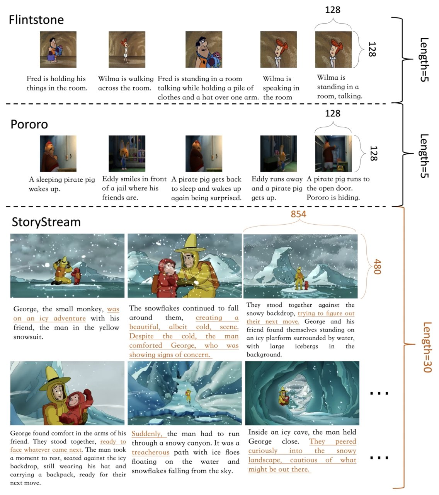

# StoryStream Dataset
[](https://huggingface.co/datasets/TencentARC/StoryStream)

## Introduction
The StoryStream dataset is an innovative resource aimed at advancing multimodal story generation. Originating from popular cartoon series, this dataset includes a comprehensive collection of detailed narratives and high resolution images. It is designed to support the creation of long story sequences. 


*Figure: Data samples from our StoryStream dataset alongside existing multimodal story generation datasets. Our dataset features visually engaging, high-resolution images paired with detailed narrative texts, mirroring the richness of real-world storybooks. The narratives in our dataset also span longer sequences, enhancing the depth of storytelling.*

## Data Format
The StoryStream dataset has three subsets:
- **Curious George**
- **Rabbids Invasion**
- **The Land Before Time**

Each subset includes:
- An **Image Package**: A tar.gz file contains all images extracted from the cartoon series.
- A **JSONL File Package**: A zip file contains multiple JSONL files. Each line in a JSONL file corresponds to a story of 30 images and their associated texts.
  - The "images" component provides a list of paths to the 30 images.
  - The "captions" component lists 30 corresponding narrative texts.

An example of a json line is like:
```bash
{"id": 102, "images": ["000258/000258_keyframe_0-19-49-688.jpg", "000258/000258_keyframe_0-19-52-608.jpg", "000258/000258_keyframe_0-19-54-443.jpg", "000258/000258_keyframe_0-19-56-945.jpg", "000258/000258_keyframe_0-20-0-866.jpg", "000258/000258_keyframe_0-20-2-242.jpg", "000258/000258_keyframe_0-20-4-328.jpg", "000258/000258_keyframe_0-20-10-250.jpg", "000258/000258_keyframe_0-20-16-673.jpg", "000258/000258_keyframe_0-20-19-676.jpg"], "captions": ["Once upon a time, in a town filled with colorful buildings, a young boy named Timmy was standing on a sidewalk. He was wearing a light green t-shirt with a building motif and matching gloves, looking excited about the day ahead.", "Soon, Timmy joined a group of people gathered in a park. Among them was a man in a yellow hat and green tie, a lady in a pink dress holding a bag and a spray bottle, and two other children in white shirts holding bags. They were all ready to start their day's activity.", "Timmy stood next to the man in the yellow hat, who was also wearing yellow gloves and a shirt with a cityscape design. Timmy, sporting a green T-shirt with a recycling symbol, held a clear plastic bag filled with recyclables and a piece of paper. They were ready to start their city clean-up mission.", "Timmy, still smiling, began walking along a sidewalk with a silver railing, excited to help clean up his beloved city, and his enthusiasm was contagious.", "The group gathered in the park, preparing for their clean-up activity. The man in the yellow hat held a clipboard, while a child nearby wore gloves and carried a trash picker. Everyone was eager to start.", "Suddenly, George, the brown monkey, appeared. He stood between two individuals, happily holding a blue bowling pin with a castle design. George was always ready to join in on the fun and lend a helping hand.", "One of the group members held a trash bag and a clipboard while wearing gloves. They were all set to start the clean-up, with George eager to help.", "As they started cleaning, one of the children handed a drawing to an adult. The drawing was of flowers, a symbol of the beauty they were trying to preserve in their city.", "The group, holding hands and carrying bags, walked down the sidewalk. They were a team, working together to make their city cleaner and more beautiful.", "As they walked, they passed a toddler in white clothes and an adult pushing a stroller. The city was bustling with life, and everyone was doing their part to keep it clean."], "orders": [0, 1, 2, 3, 4, 5, 6, 7, 8, 9]}
```
For optimal training efficiency, consider chunking the stories into segments of 10 images each, as demonstrated in our research paper. The script for this process, `StoryStream/chunk_data.py`, is available in the repository.

## Training with StoryStream
Please refer to the "build_long_story_datapipe" in `src/data/story_telling.py` for building a dataloader.